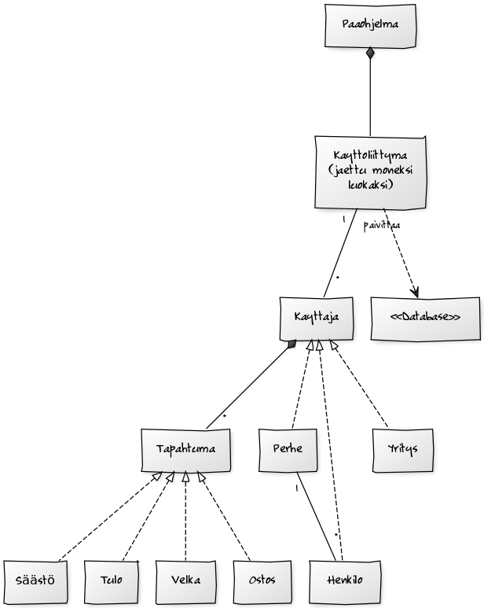

###Aiheen kuvaus ja rakenne

**Aihe:** Budjettikirjanpito

Toteutetaan ohjelma, jonne on mahdollista asettaa käyttäjän palkka, syöttää menoja ja seurata, miten raha riittää. Ohjelmasta pystyisi myös näkemään, kuinka paljon rahaa menee mihinkin. Normaalien menojen lisäksi budjettiin saa lisättyä lainan tai aloittaa säästön jotain kohdetta varten. Ohjelman tarkoitus on saada käyttäjä kohtaamaan kaikki omat menonsa, ja siksi ohjelmaa suositellaan erityisesti törsäilijöille. Soveltuu niin yksittäisen henkilön, suuren kotitalouden kuin yrityksenkin käyttöön.

###### Rakenne

Ohjelma jakautuu tietokanta- ja käyttöliittymäpakkaukseen sekä logiikkapakkauksiin.

Logiikka jakautuu käyttäjiä sekä tapahtumia (rahaliikenne) koskeviin pakkauksiin. Käyttäjä-pakkauksessa on luokka Käyttäjä sekä tämän aliluokat Henkilo, Perhe ja Yritys. Tapahtuma-pakkauksessa on luokka Tapahtuma sekä sen aliluokat Ostos, Velka, Tulo ja Saasto.

Käyttöliittymäpakkauksessa (gui) on Pääohjelma, josta ajetaan Käyttöliittymä-luokan metodi käynnistä(). Lisäksi Käyttöliittymä-luokka pitää hallussaan väliaikaismuistia (kayttajat ja current) ja kutsuu muita pakkauksen luokkia sen mukaan kuin on tarve. Ohjelmassa on tekstikäyttöliittymä, joka on aiheittain jaettu eri luokkiin. Varsinaisia attribuutteja ei näissä luokissa juuri ole, vaan ne on sitä varten, ettei Käyttöliittymä-luokan koko olisi 2000 riviä (niin kuin se alun perin oli). Esim. jos ohjelman käyttäjä haluaa lisätä uuden käyttäjän, kutsuu Käyttöliittymä luokan Kayttajanlisays metodia uudenKayttajanLisays. Nämä luokat sisältävät paljon tulostusta (muodostavat yhdessä tekstikäyttöliittymän) ja käyttävät Käyttöliittymän scanneria.

Database-kansiossa on Database-luokka, joka muodostaa Kayttaja-olioista ser-tiedostoja ja nimeää ne olion käyttäjätunnuksen mukaan. Tämä mahdollistaa, että ohjelman suljettuakin käyttäjän tiedot säilyvät. Luotaessa uusi käyttäjä, luodaan uusi ser-tiedostokin ja mikäli käyttäjä poistetaan, ser-tiedostokin poistetaan.

**Käyttäjät:** Henkilö, perhe tai yritys

**Käyttäjän toiminnot:** 

* Uuden käyttäjätunnuksen luonti
* Oman käyttäjätunnuksen poisto
* Sisään ja ulos kirjautuminen
* Ostosten, tulojen, velkojen sekä säästöjen lisääminen ja poistaminen
* Rahatilanteen seuraaminen
* Maksu- ja säästösuunnitelman seuraaminen
* Tietojen talletus

